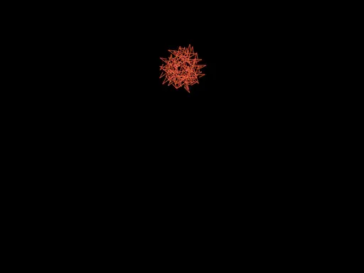
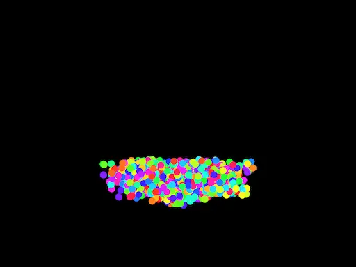
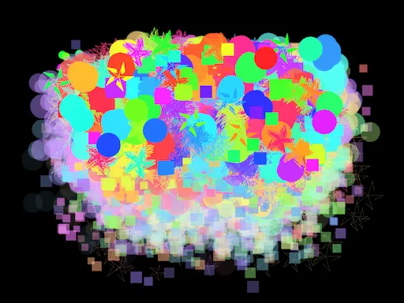

#### Exploraremos los conceptos desde el arte generativo

🎯 **Enunciado**: en esta actividad te mostraré una aplicación donde aplicaremos 
todos los conceptos que estudiarás en esta unidad. 

Durante la actividad te indicaré los momentos en los que debes detenerte para 
analizar 🧐, experimentar 🧪 y reportar ✍️ tus hallazgos en la bitácora de 
aprendizaje.

Crea un proyecto en openFrameworks y adiciona el siguiente código.

ofApp.h

``` cpp
#pragma once
#include "ofMain.h"
#include <vector>

// -------------------------------------------------
// Clase base abstracta: Particle
// -------------------------------------------------
class Particle {
public:
    virtual ~Particle() {}
    virtual void update(float dt) = 0;
    virtual void draw() = 0;
    virtual bool isDead() const = 0;
    // Nuevo método para saber si la partícula (tipo RisingParticle) debe explotar
    virtual bool shouldExplode() const { return false; }
    // Métodos para obtener posición y color, para usarlos en explosiones
    virtual glm::vec2 getPosition() const { return glm::vec2(0, 0); }
    virtual ofColor getColor() const { return ofColor(255); }
};

// -------------------------------------------------
// RisingParticle: Partícula que nace en la parte inferior central y sube
// -------------------------------------------------
class RisingParticle : public Particle {
protected:
    glm::vec2 position;
    glm::vec2 velocity;
    ofColor color;
    float lifetime; // tiempo máximo antes de explotar
    float age;
    bool exploded;
public:
    RisingParticle(const glm::vec2& pos, const glm::vec2& vel, const ofColor& col, float life)
        : position(pos), velocity(vel), color(col), lifetime(life), age(0), exploded(false) {
    }

    void update(float dt) override {
        position += velocity * dt;
        age += dt;
        // Aumenta la desaceleración para dar sensación de recorrido largo
        velocity.y += 9.8f * dt * 8;
        // Condición de explosión: cuando la partícula alcanza aproximadamente el 15% de la altura
        float explosionThreshold = ofGetHeight() * 0.15 + ofRandom(-30, 30);
        if (position.y <= explosionThreshold || age >= lifetime) {
            exploded = true;
        }
    }

    void draw() override {
        ofSetColor(color);
        // Partícula más grande
        ofDrawCircle(position, 10);
    }

    bool isDead() const override { return exploded; }
    bool shouldExplode() const override { return exploded; }
    glm::vec2 getPosition() const override { return position; }
    ofColor getColor() const override { return color; }
};

// -------------------------------------------------
// Clase base para explosiones: ExplosionParticle
// -------------------------------------------------
class ExplosionParticle : public Particle {
protected:
    glm::vec2 position;
    glm::vec2 velocity;
    ofColor color;
    float age;
    float lifetime;
    float size;  // tamaño de la partícula de explosión
public:
    ExplosionParticle(const glm::vec2& pos, const glm::vec2& vel, const ofColor& col, float life, float sz)
        : position(pos), velocity(vel), color(col), age(0), lifetime(life), size(sz) {
    }

    void update(float dt) override {
        position += velocity * dt;
        age += dt;
        float alpha = ofMap(age, 0, lifetime, 255, 0, true);
        color.a = alpha;
    }

    bool isDead() const override { return age >= lifetime; }
};

// -------------------------------------------------
// CircularExplosion: Explosión en patrón circular
// -------------------------------------------------
class CircularExplosion : public ExplosionParticle {
public:
    CircularExplosion(const glm::vec2& pos, const ofColor& col)
        : ExplosionParticle(pos, glm::vec2(0, 0), col, 1.2f, ofRandom(16, 32)) {
        float angle = ofRandom(0, TWO_PI);
        float speed = ofRandom(80, 200);
        velocity = glm::vec2(cos(angle), sin(angle)) * speed;
    }

    void draw() override {
        ofSetColor(color);
        ofDrawCircle(position, size);
    }
};

// -------------------------------------------------
// RandomExplosion: Explosión con direcciones aleatorias
// -------------------------------------------------
class RandomExplosion : public ExplosionParticle {
public:
    RandomExplosion(const glm::vec2& pos, const ofColor& col)
        : ExplosionParticle(pos, glm::vec2(0, 0), col, 1.5f, ofRandom(16, 32)) {
        velocity = glm::vec2(ofRandom(-200, 200), ofRandom(-200, 200));
    }

    void draw() override {
        ofSetColor(color);
        ofDrawRectangle(position.x, position.y, size, size);
    }
};

// -------------------------------------------------
// StarExplosion: Explosión en forma de estrella
// -------------------------------------------------
class StarExplosion : public ExplosionParticle {
public:
    StarExplosion(const glm::vec2& pos, const ofColor& col)
        : ExplosionParticle(pos, glm::vec2(0, 0), col, 1.3f, ofRandom(20, 40)) {
        float angle = ofRandom(0, TWO_PI);
        float speed = ofRandom(90, 180);
        velocity = glm::vec2(cos(angle), sin(angle)) * speed;
    }

    void draw() override {
        ofSetColor(color);
        int rays = 5;
        float outerRadius = size;
        float innerRadius = size * 0.5;
        ofPushMatrix();
        ofTranslate(position);
        for (int i = 0; i < rays; i++) {
            float theta = ofMap(i, 0, rays, 0, TWO_PI);
            float xOuter = cos(theta) * outerRadius;
            float yOuter = sin(theta) * outerRadius;
            float xInner = cos(theta + PI / rays) * innerRadius;
            float yInner = sin(theta + PI / rays) * innerRadius;
            ofDrawLine(0, 0, xOuter, yOuter);
            ofDrawLine(xOuter, yOuter, xInner, yInner);
        }
        ofPopMatrix();
    }
};

// -------------------------------------------------
// ofApp: Manejo de la escena y eventos
// -------------------------------------------------
class ofApp : public ofBaseApp {
public:
    void setup();
    void update();
    void draw();
    void mousePressed(int x, int y, int button);
	void keyPressed(int key);

    std::vector<Particle*> particles;
    ~ofApp();

private:
	void createRisingParticle();

};

``` 

ofApp.cpp

``` cpp
#include "ofApp.h"

// --------------------------------------------------------------
void ofApp::setup() {
    ofSetFrameRate(60);
    ofBackground(0);
}

// --------------------------------------------------------------
void ofApp::update() {
    float dt = ofGetLastFrameTime();

    // Actualiza todas las partículas
    for (int i = 0; i < particles.size(); i++) {
        particles[i]->update(dt);
    }

    // Procesa las partículas (iteración en reversa para facilitar eliminación)
    for (int i = particles.size() - 1; i >= 0; i--) {
        // Si la partícula debe explotar, generamos nuevas explosiones
        if (particles[i]->shouldExplode()) {
            int explosionType = (int)ofRandom(3); // 0: Circular, 1: Random, 2: Star
            int numParticles = (int)ofRandom(20, 30);
            for (int j = 0; j < numParticles; j++) {
                if (explosionType == 0) {
                    particles.push_back(new CircularExplosion(particles[i]->getPosition(), particles[i]->getColor()));
                }
                else if (explosionType == 1) {
                    particles.push_back(new RandomExplosion(particles[i]->getPosition(), particles[i]->getColor()));
                }
                else {
                    particles.push_back(new StarExplosion(particles[i]->getPosition(), particles[i]->getColor()));
                }
            }
            delete particles[i];
            particles.erase(particles.begin() + i);
        }
        else if (particles[i]->isDead()) {
            delete particles[i];
            particles.erase(particles.begin() + i);
        }
    }
}

// --------------------------------------------------------------
void ofApp::draw() {
    for (int i = 0; i < particles.size(); i++) {
        particles[i]->draw();
    }
}

// --------------------------------------------------------------
void ofApp::createRisingParticle() {
	// Genera una RisingParticle cerca del centro inferior (con variación horizontal)
	float minX = ofGetWidth() * 0.35;
	float maxX = ofGetWidth() * 0.65;
	float spawnX = ofRandom(minX, maxX);
	glm::vec2 pos(spawnX, ofGetHeight());
	// La partícula apunta hacia un objetivo en la parte superior central
	glm::vec2 target(ofGetWidth() / 2 + ofRandom(-300, 300), ofGetHeight() * 0.10 + ofRandom(-30, 30));
	glm::vec2 direction = glm::normalize(target - pos);
	// Velocidad ajustada para recorrer una mayor distancia
	glm::vec2 vel = direction * ofRandom(250, 350);
	ofColor col;
	col.setHsb(ofRandom(255), 220, 255);
	float lifetime = ofRandom(1.5, 3.5); // Tiempo de vida antes de explotar
	particles.push_back(new RisingParticle(pos, vel, col, lifetime));
}

// --------------------------------------------------------------
void ofApp::mousePressed(int x, int y, int button) {
    createRisingParticle();
}

// --------------------------------------------------------------
void ofApp::keyPressed(int key) {
	if (key == ' ') {
		for (int i = 0; i < 1000; i++) {
			createRisingParticle();
		}
	}
    if (key == 's') {
        ofSaveScreen("screenshot_" + ofToString(ofGetFrameNum()) + ".png");
    }
}

// --------------------------------------------------------------
ofApp::~ofApp() {
    for (int i = 0; i < particles.size(); i++) {
        delete particles[i];
    }
    particles.clear();
}
```

🧐🧪✍️ Analiza el código de la aplicación y trata de explicar en tus propias palabras, NO USES 
por favor, chatGPT, lo que hace este código. Captura pantallas de la aplicación funcionando y 
añádelas a la bitácora de aprendizaje.

Cuando ejecutes la aplicación deberías ver algo como esto:

  



  



🧐🧪✍️ ¿Cómo puedes interactuar con la aplicación?

📤 **Entrega**: reporta en la bitácora tu hallazgos en todos los puntos que te 
marqué para analizar 🧐, experimentar 🧪 y reportar ✍️.

